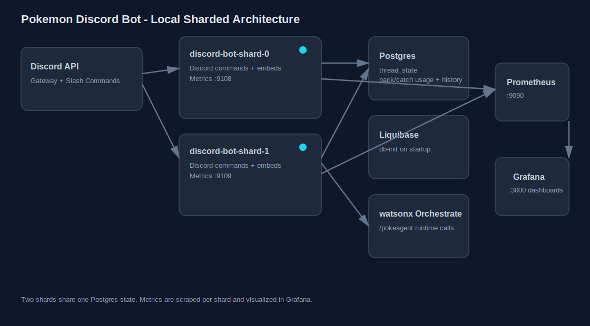

# Pokemon Discord Bot

A Discord bot for Pokemon TCG + Pokemon catching, with sharded runtime support, Postgres-backed state, and Prometheus/Grafana monitoring.

## Features

- `/pokeagent question:<text>` chat with the Pokemon TCG agent
- `/open_pack set_name:<set>` open cosmetic packs (daily rate limit, paginated embeds)
- `/my_cards` view your collection grouped by set (paginated embeds)
- `/catch` and `$catch` roll a catch board (daily rate limit)
- `/pokebox` and `$pokebox` browse caught Pokemon with paging and sort options (`recent`, `id`, `name`, `region`, `type`)
- `/grantpokemon` and `$grantpokemon` test grant command restricted to Discord username `chewychiyu`

## Stack

- Python 3.11
- `uv` for dependency and lockfile management
- Discord.py
- Postgres for shared state
- Liquibase for DB migrations
- Prometheus + Grafana for usage metrics

## Quick Start

1. Copy env template and set secrets:
   - `cp .env.example .env`
2. Install deps:
   - `uv sync --locked`
3. Run locally:
   - `uv run python bot/discord_wxo_bot.py`

For full local stack (Postgres + shards + monitoring):

- `docker compose up --build`

## Commands

- `/pokeagent question:<text>`
- `/open_pack set_name:<set>`
- `/my_cards`
- `/catch` or `$catch`
- `/pokebox sort_by:<recent|id|name|region|type>` or `$pokebox`
- `/grantpokemon user:<user> count:<n>` or `$grantpokemon` (restricted)
- `@Bot sync [global|guild|copy|clear]` (owner-only helper)

## Monitoring

- Prometheus: `http://localhost:9090`
- Grafana: `http://localhost:3000`
- Bot metrics include:
  - `discord_command_total{command,outcome}`
  - `discord_command_hour_total{command,hour_utc}`
  - `discord_command_duration_seconds{command,outcome}`
  - `discord_open_pack_set_total{set_name}`

## Screenshots

Use `docs/screenshots/` for all Discord/Grafana screenshots.

- Guide: `docs/screenshots/README.md`
- Caption/order manifest: `docs/screenshots/manifest.md`

After you drop files there, tell me and I will format the final README gallery.

## Security Notes

- Never commit `.env` or credential files.
- Rotate any credential that was ever committed or shared.
- Use `.env.example` as the only committed env template.
- Before pushing, run a quick scan:
  - `rg -n --hidden --glob '!.git/*' --glob '!.venv/*' '(DISCORD_BOT_TOKEN|WO_API_KEY|WXO_API_KEY|password=|token=)' .`

## Docs

- Bot command and env details: `bot/README.md`
- DB changelogs: `db/changelog/db.changelog-master.xml`
- Monitoring config: `monitoring/`
