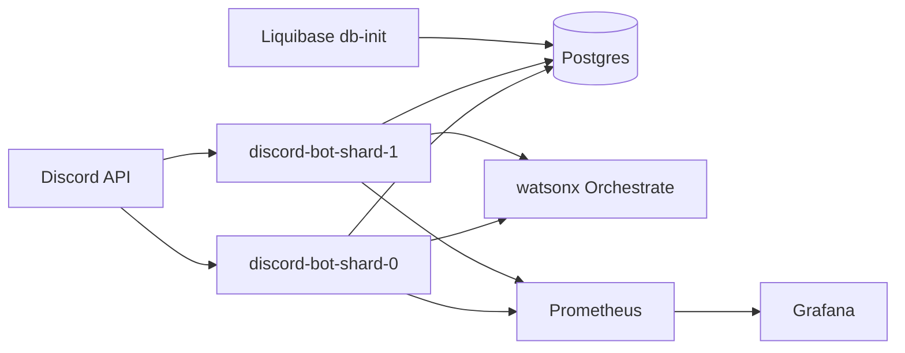
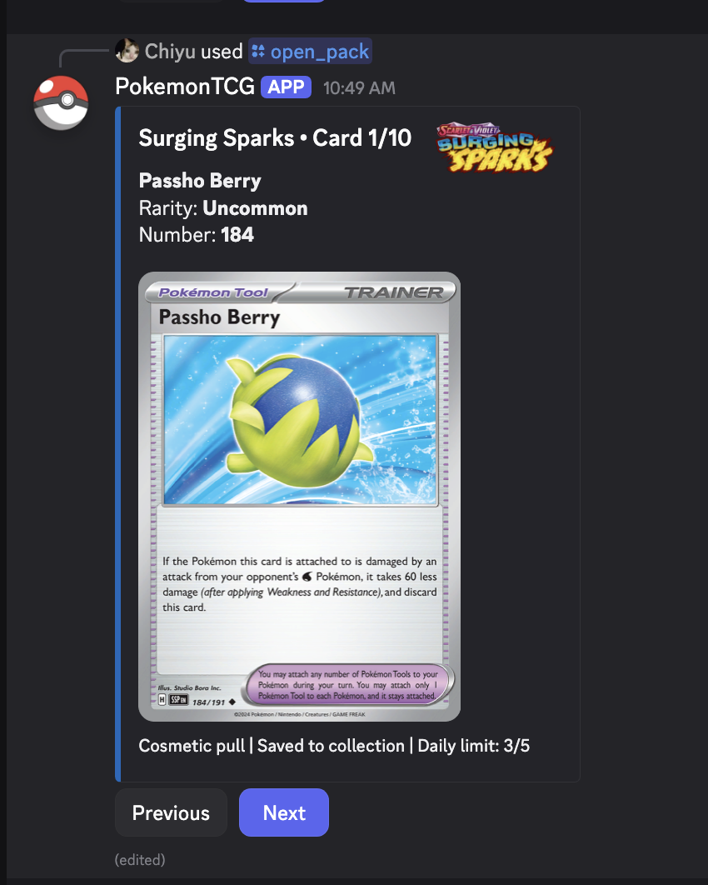
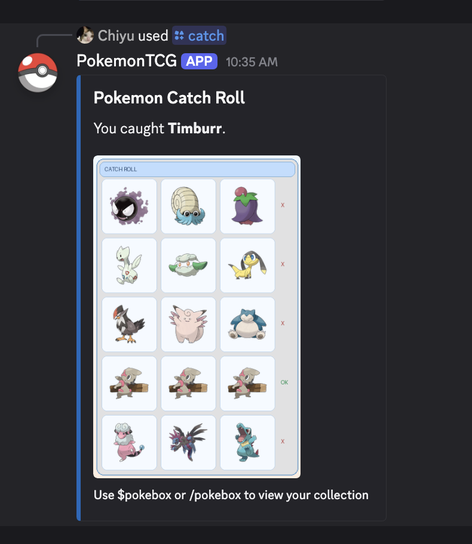
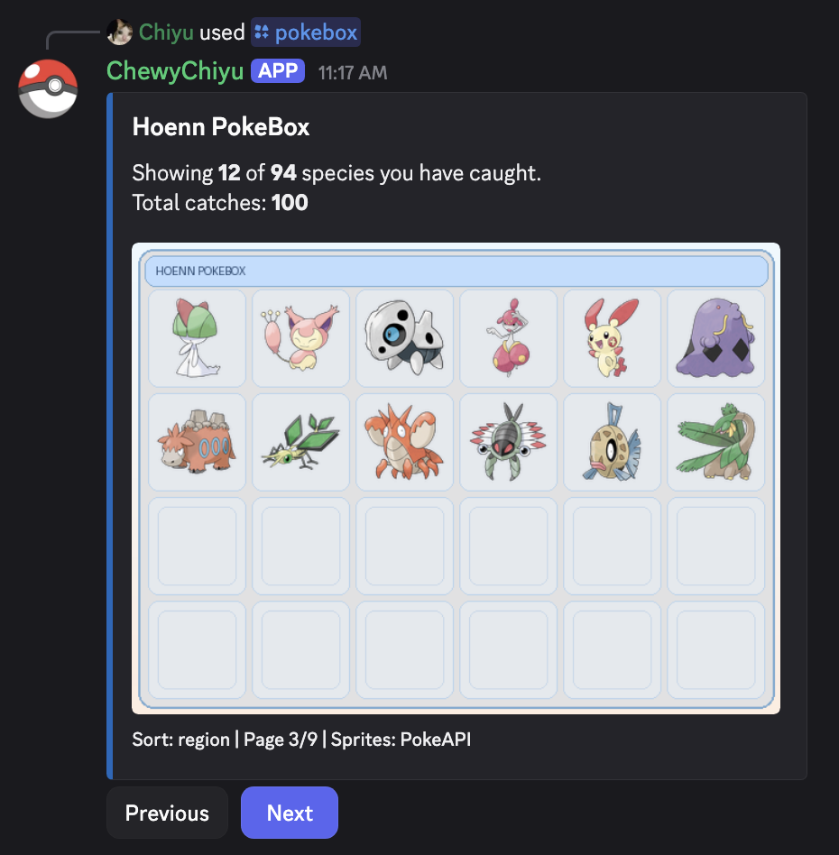
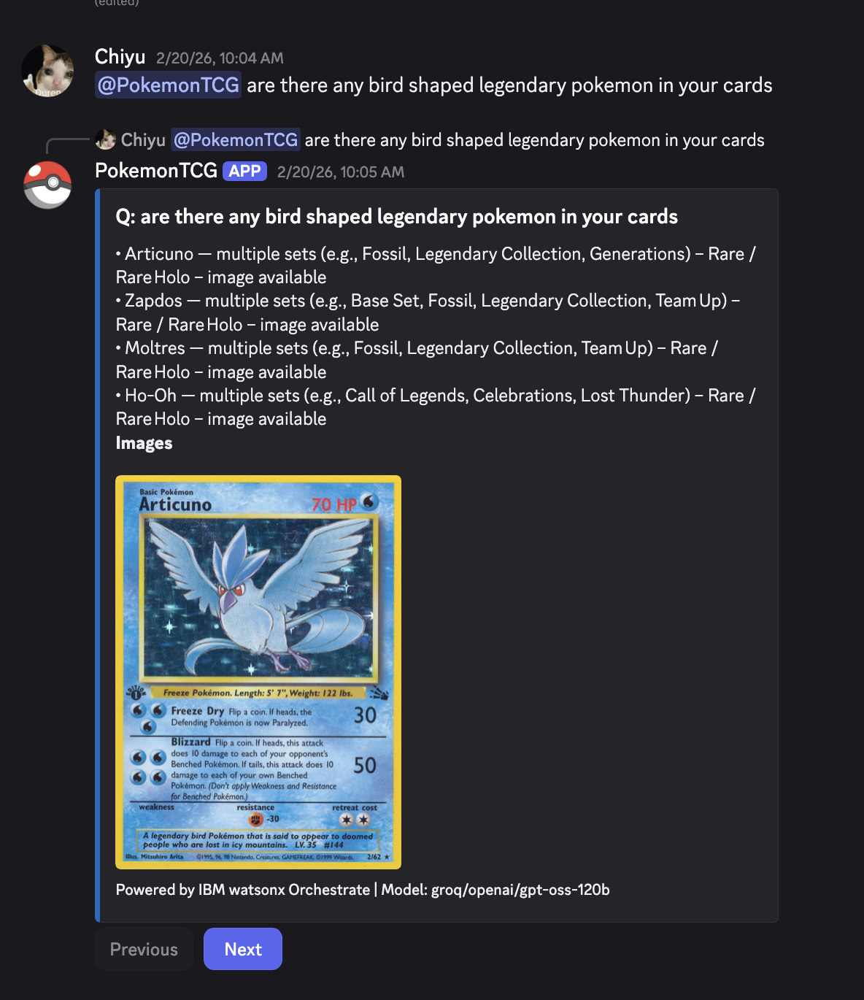

# Pokemon Discord Bot

A Discord bot for Pokemon TCG + Pokemon catching, with sharded runtime support, Postgres-backed state, and Prometheus/Grafana monitoring.

## Features

- `/pokeagent question:<text>` chat with the Pokemon TCG agent
- `/open_pack set_name:<set>` open cosmetic packs (daily rate limit, paginated embeds)
- `/my_cards` view your collection grouped by set (paginated embeds)
- `/catch` and `$catch` roll a catch board (daily rate limit)
- `/pokebox` and `$pokebox` browse caught Pokemon with paging and sort options (`recent`, `id`, `name`, `region`, `type`)
- `/grantpokemon` and `$grantpokemon` test grant command restricted to Discord username `chewychiyu`

## Stack

- Python 3.11
- `uv` for dependency and lockfile management
- Discord.py
- Postgres for shared state
- Liquibase for DB migrations
- Prometheus + Grafana for usage metrics

## Quick Start

1. Copy env template and set secrets:
   - `cp .env.example .env`
2. Install deps:
   - `uv sync --locked`
3. Run locally:
   - `uv run python bot/discord_wxo_bot.py`

For full local stack (Postgres + shards + monitoring):

- `docker compose up --build`

## Commands

- `/pokeagent question:<text>`
- `/open_pack set_name:<set>`
- `/my_cards`
- `/catch` or `$catch`
- `/pokebox sort_by:<recent|id|name|region|type>` or `$pokebox`
- `/grantpokemon user:<user> count:<n>` or `$grantpokemon` (restricted)
- `@Bot sync [global|guild|copy|clear]` (owner-only helper)

## PokeAgent Setup

1. Create/get your Orchestrate account: https://www.ibm.com/products/watsonx-orchestrate
2. Get ADK environment credentials: https://developer.watson-orchestrate.ibm.com/environment/initiate_environment
3. Set these in `.env`:
   - `WO_INSTANCE`
   - `WO_API_KEY`
   - `WO_AGENT_NAME` (default: `pokemon_tcg_agent`)
   - `WO_ENV` (default: `local`)
   - Optional runtime override for bot only:
     - `WO_RUNTIME_INSTANCE`
     - `WO_RUNTIME_API_KEY`
   - Optional local runtime auth (used when `WO_RUNTIME_INSTANCE` points to local):
     - `WO_LOCAL_USERNAME` (default: `wxo.archer@ibm.com`)
     - `WO_LOCAL_PASSWORD` (default: `watsonx`)
4. Import bot resources (tools + knowledge base + agent):
   - `scripts/import_wxo_from_env.sh all`
   - this script activates `WO_ENV` first, then imports tools, KB, and agent

If required credentials are missing/invalid for the configured runtime target, `/pokeagent` will be unavailable.

## Monitoring

- Prometheus: `http://localhost:9090`
- Grafana: `http://localhost:3000`
- Bot metrics include:
  - `discord_command_total{command,outcome}`
  - `discord_command_hour_total{command,hour_utc}`
  - `discord_command_duration_seconds{command,outcome}`
  - `discord_open_pack_set_total{set_name}`

## Screenshots

Discord Command Screens

 

 

 

## Docs

- Bot command and env details: `bot/README.md`
- DB changelogs: `db/changelog/db.changelog-master.xml`
- Monitoring config: `monitoring/`
